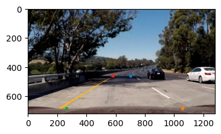
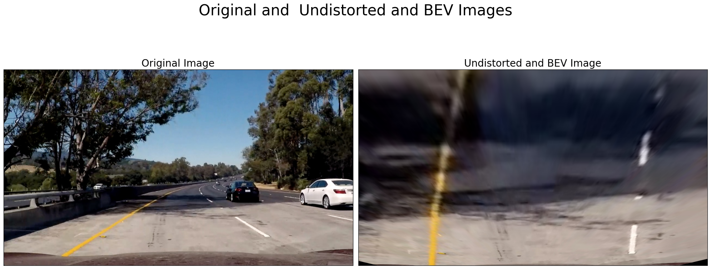
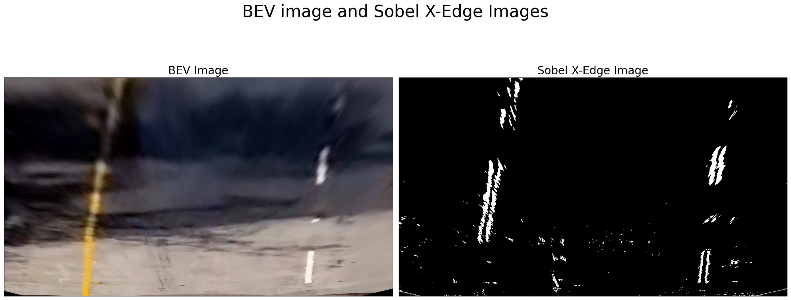
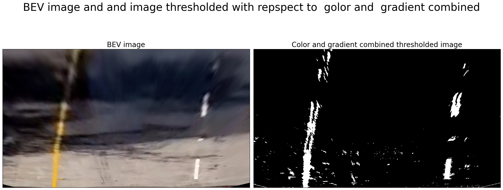
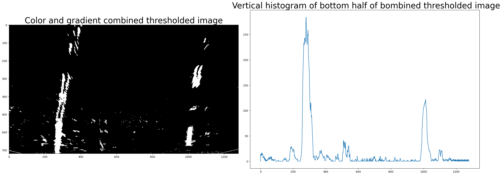
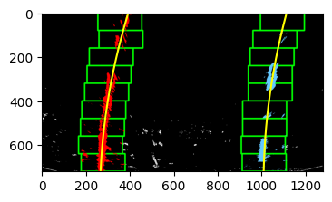
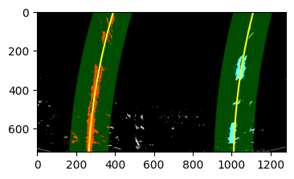
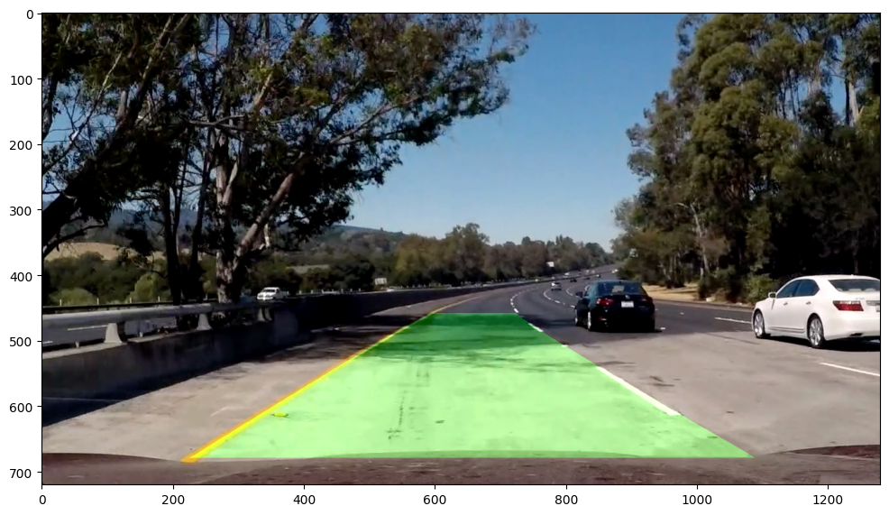

# Camera-based-ADAS
This project is a part of Computer Vision course at Innopolis University - Spring 23

---

## Introduction: 
ADAS (Advanced Driver Assistance Systems) are passive and active safety systems designed to remove the human error component when operating vehicles of many types. 
In this project we are focusing on the following tasks: 
1. **Classical lane finding :** classical approach
2. **Detecting other vehicles :** using YOLOv8  
3. **Track vehicles :** using ByteTrack
4. **Advanced lane finding:** using hybrid nets

## 1. Classical lane finding :
detect lane lines from an image using sobel filter and color thresholding. and then use sliding window to fit the detected lines
### 1. Slice fixed regieon form the image where the lane is expected to be:
 
### 2. Convert to BEV: 
Transforming an image such that we are effectively viewing objects from a different angle or direction. so we convert the image to BEV perspective or top-down view of the road so we can measure the curvature of a lane line
 
### 3.Detect lane border:
After finding the BEV of the area of interest in the image we want to detect lane border.
we will use to find these lines:
1. Edges
2. Color
#### 4.1 Using edges: 
applying sobel-x filter to detect lanes border as the lanes are always vertical in the considered images
 
#### 4.2 Using Color thresholding: 
Hue is a property of color that remains constant regardless of changes in brightness, while Lightness and Value measure the degree of lightness or darkness of a color. Saturation, on the other hand, measures the intensity or vividness of color. In order to identify lane lines in various lighting scenarios, including shadowed areas, We used the cv2.cvtColor() function with the COLOR_RGB2HLS argument to isolate the saturation channel.And to improve the accuracy,  We combined the saturation and lightness channels and applied a binary threshold to select pixels within specific ranges (120-255 for saturation and 200-255 for lightness). This resulted in accurate detection of the white dashed lines as lane markers.
 
#### 5 Find the vertical histogram: 
We took only the down-half of the image where the lane expected to be more visible, then we found the vertical histogram by suming the pixles in each colnum. And this histogram will give picks on the position of the lanes. and by thresholding this histogram we got the potential position for the start of left and right lanes.
 
#### 6 Using sliding window to find the point of the lanes:
we used fixed size  window and moved it vertically starting form the expect position  of the left lane inthe image and counted the number of points in each window , find its center, and then we did polyfit with second order polynomial on these centers to find the left lane. we did the same procedure for the right lane. 

 

#### 7 Find lane search region:
Once we have used the sliding windows function and detected lane lines and right and left lane indicies, we can return these values for the next frame in the video to search around for lane lines based on activated x-values within the +/- margin of our polynomial function.
 

#### 8 lane curvature and offset form the center of the lane:
We calculated  the lane lines curvature and the centre offset of vehicle within lane assuming camera is mounted directly in the middle centreline of vehicle
#### 9 Show the detect lanes on the original image
 

### 2. Detecting other vehicles :
We used YOLOv8 algorithm to detect four classes:car, motorcycle, bus and truck . (we used pretrained yolov8x)
### 3. Track viechels using ByteTrack :
ByteTrack is a simple, fast and strong multi-object tracker.it use simple, effective and generic association method, tracking by associating every detection box instead of only the high score ones. For the low score detection boxes, it utilize their similarities with tracklets to recover true objects and filter out the background detections.
### 4. Videos :
we applied the classical lane detection and cars detection and tracking two test videos.

## HybridNets
The HybridNets neural network was introduced by VT Dat et al. in the paper [HybridNets: End-to-End Perception Network](https://arxiv.org/abs/2203.09035). This is a multi-task neural network that can carry out end-to-end visual perception. In other words, this neural network can do both, detection, and segmentation.

### Why Are Multi-Task Neural Networks Important?
The big question here is “why do we need such a neural network?”. In autonomous driving, the visual perception neural network does multiple tasks. It has a complex structure for detecting humans, other vehicles, and the drivable area, and does a myriad of other challenging yet safety-critical tasks.

Such tasks cannot be achieved by a simple linear neural network that does just classification, detection, or segmentation. We need neural networks that can multitask. Hence, the term end-to-end multi-task visual perception.

he HybridNets neural network has a major significance in autonomous driving where end-to-end visual perception is critical and speed of computation is also paramount. It does traffic object detection, drivable area segmentation, and lane detection (segmentation) as well.
